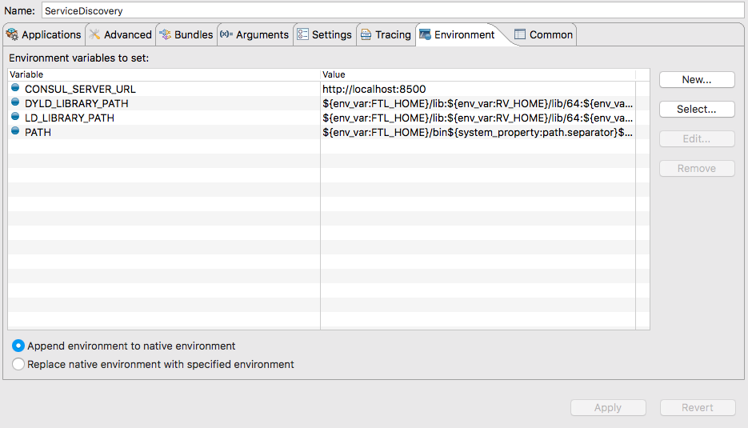

# BWCE Showcase
Showcase of BWCE Features with Examples

## Circuit Breaker
### BWCE_Showcase_CircuitBreaker
Project containing examples using the Circuit Breaker feature
- Hystrix: A Hystrix Server is required to view the Circuit Breaker Status
  - A simple Hystrix Server can be started using Docker
  - <i>git clone https://github.com/mlabouardy/hystrix-dashboard-docker.git hystrix-dashboard-docker</i>
  - <i>docker build -t hystrix/dashboard .</i>
  - <i>docker run -d -p 9002:9002 --name hystrix-dashboard hystrix/dashboard:latest</i>
  - Once running navigate to http://localhost:9002/hystrix
  - Enter the following: http://\<routable url\>:8090/hystrix.stream
    - The routable url must be accessible from within the Docker container. If you are running the service locally, use your machine's local IP address

- CircuitBreakerAPI: Rest API which invokes a downstream service. Accepts a query parameter (success:boolean) that triggers the downstream service to return either successfully (200) or unsuccessfully (500). Invoking this API multiple times with success=false will cause the Circuit to Open. This demonstrates the ability to distinguish between a downstream service failure and a Circuit being open.

- CircuitBreakerAPI2: Similiar in most respects to the above API, this service demonstrates a more typical approach of retrying a service call several times (ex: 3) before failing. Instead of returning an error to the consumer this service calls alternate paths depending on whether the service has failed or the Circuit is Open.

## Service Discovery
### BWCE_Showcase_ServiceDiscovery
Project containing examples using the Service Discovery feature
- Consul Server: A Consul Server is required for this example
  - A simple Consul Server can be started using Docker
  - <i>docker pull progrium/consul</i>
  - <i>docker run -d -p 8400:8400 -p 8500:8500 -p 8600:53/udp -h node1 progrium/consul -server -bootstrap -ui-dir /ui</i>
  - Once running navigate to http://localhost:8500/ui and confirm the server has started
  
- Environment Variable: Before running this example you must set the Environment Variable "CONSUL_SERVER_URL"
  - In Studio this can be done in the Run Configuration, Environment Tab
  
  
  
- ServiceDiscoveryAPI: Simple service that returns a standard message. This service uses an HTTP Resource that has the Service Discovery option enabled and registers itself with the Consul Server as it initializes. Once the Service is running, navigate to http://localhost:8500/ui and confirm there is a "ServiceDiscoveryAPI" key entry. Invoking this service from the Swagger UI does NOT use the Consul Server. The ServiceDiscoveryConsumerAPI service described below does.

- ServiceDiscoveryConsumerAPI: Invoking this service causes the ServiceDiscoveryAPI service to be invoked. The HTTP Client Resource used to invoke it has the Service Discovery option enabled and performs a look up in the Consul Server for the "ServiceDiscoveryAPI" key.
